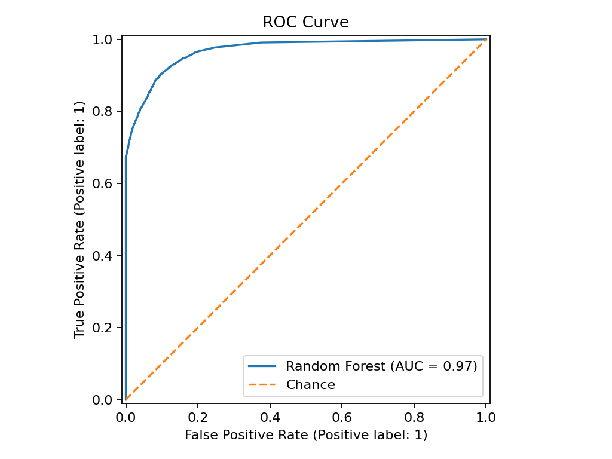
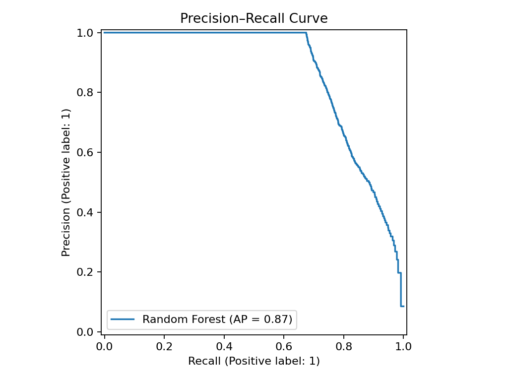
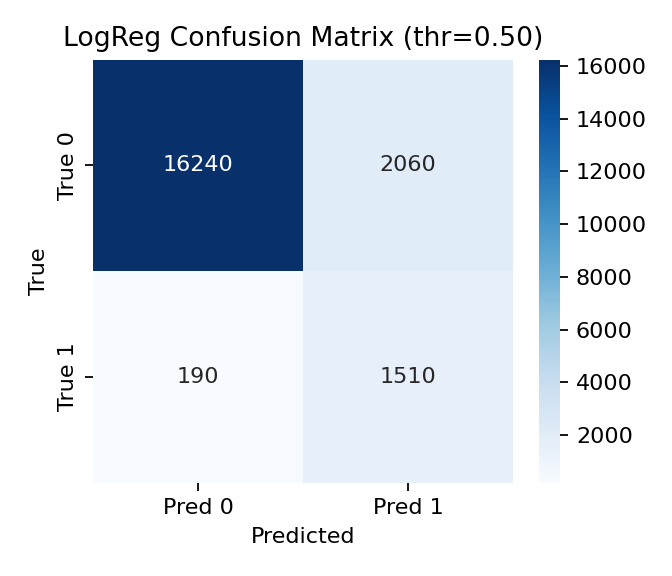
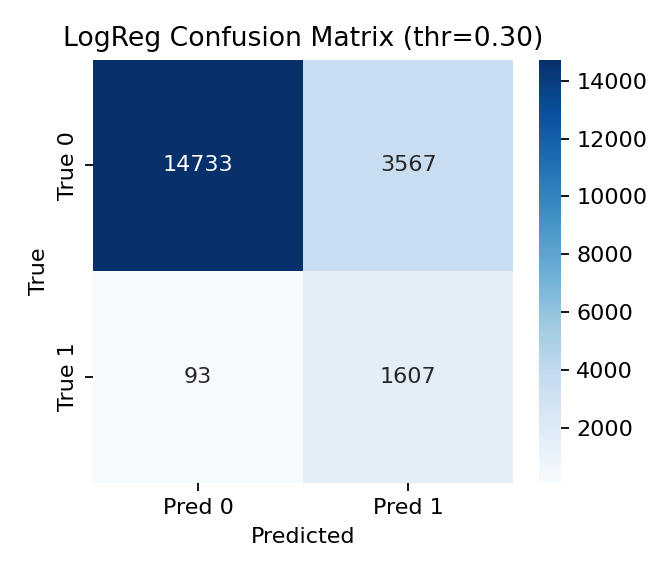
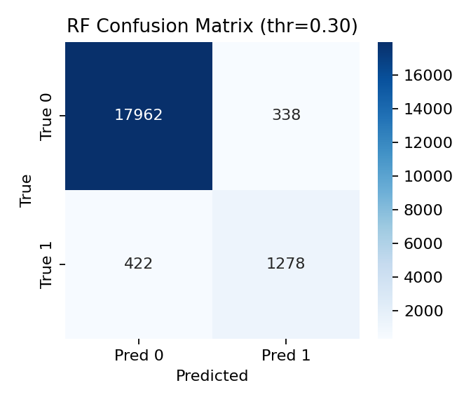

# 🩺 Diabetes Prediction App

> Machine Learning pipeline + Streamlit app to **predict diabetes risk** from demographic and clinical data.  
> Includes training notebook, evaluation metrics, visualizations, and an **interactive web app** with adjustable threshold.

---

## 📌 Project Highlights
- End-to-end ML workflow (data preprocessing → training → evaluation → deployment)
- Models: **Logistic Regression** (high recall) and **Random Forest** (high precision)
- Streamlit app with:
  - Threshold slider to trade off Recall vs Precision
  - Holdout validation section
  - Easy integration with **Google Colab + ngrok**
- Visual assets (ROC, PR, confusion matrices) included for reporting

---

Predict diabetes risk from demographic and clinical features (age, BMI, HbA1c, glucose, etc.) using **Logistic Regression** and **Random Forest**.  
Includes an interactive **Streamlit** app with a **threshold slider** to trade off **Recall** vs **Precision**, and an in-app **validation** section.

## 🔍 Problem
Binary classification: `diabetes` (0 = no, 1 = yes)

**Features**: `gender, age, hypertension, heart_disease, smoking_history, bmi, HbA1c_level, blood_glucose_level`  
**Target**: `diabetes`

Dataset in this project contained **100,000 rows** with an **imbalanced** target (~8.5% positives).

---

## 📈 Results (Test Set @ threshold = 0.50)

| Model                         | Accuracy | Precision | Recall | F1    | ROC-AUC |
|------------------------------|----------|-----------|--------|-------|---------|
| Logistic Regression (bal.)   | 0.8875   | 0.4230    | **0.8882** | 0.5731 | 0.9625  |
| Random Forest (bal.)         | **0.9698** | **0.9377** | 0.6906 | **0.7954** | **0.9694** |

**Interpretation**  
- **Logistic Regression**: very **high Recall** (catches most diabetics), lower Precision (more false alarms).  
- **Random Forest**: very **high Precision** (few false alarms), lower Recall (misses some diabetics).  
- Both models have **excellent ROC-AUC** (~0.96–0.97).

**Default threshold**  
We set the app’s default threshold to **0.45** for Logistic Regression based on a sweep to favor **high Recall (~91%)** suitable for **screening** use-cases. The UI lets you change the threshold and model.

---

## 🖼️ Key Visuals

ROC and PR curves:
  

Confusion matrices (LR and RF at 0.50 and 0.30):
   
 

---

## 🧪 How to Run the Notebook

Open [`notebooks/diabetes.ipynb`](notebooks/diabetes.ipynb) (works in **Colab** or **Jupyter**).  
The notebook is structured with clear **“what we’ll do”** and **“what we got”** explanations around each code cell.

### Steps inside the notebook:
1. Load & sanity-check data  
2. Preprocess (explicit encoding for `gender` and `smoking_history`)  
3. Train models (Logistic Regression + Random Forest)  
4. Evaluate metrics (Accuracy, Precision, Recall, F1, ROC-AUC, Confusion Matrix)  
5. Perform threshold sweep & export artifacts  
6. Visualize (ROC Curve, Precision-Recall, Confusion Matrices)  

### Notebook Exports:
- `app/diabetes_model.pkl` → Logistic Regression pipeline  
- `app/diabetes_rf.pkl` → Random Forest model  
- `app/X_test.csv` & `app/y_test.csv` → For in-app validation  
- `app/benchmark_metrics.json` → Optional baseline metrics  

---

## 🌐 Running the Streamlit App in Google Colab (via ngrok)

You can run the **Streamlit app** directly in **Google Colab** and expose it to the web using **ngrok**.

Open [`notebooks/PredictionDiabetic.ipynb`](notebooks/PredictionDiabetic.ipynb) (works in Colab or Jupyter).

### 📂 Required Files to Upload in Colab:
Before running the app, upload these files into your Colab working directory:
- `diabetes_app.py`  
- `diabetes_model.pkl`  
- `diabetes_rf.pkl`  
- `X_test.csv`  
- `y_test.csv`  
- `benchmark_metrics.json` 
